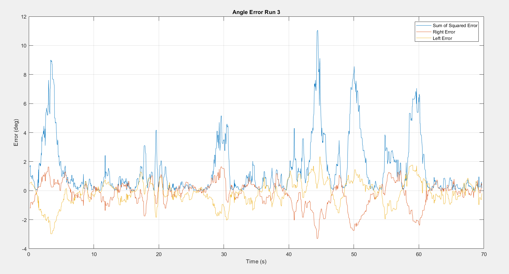
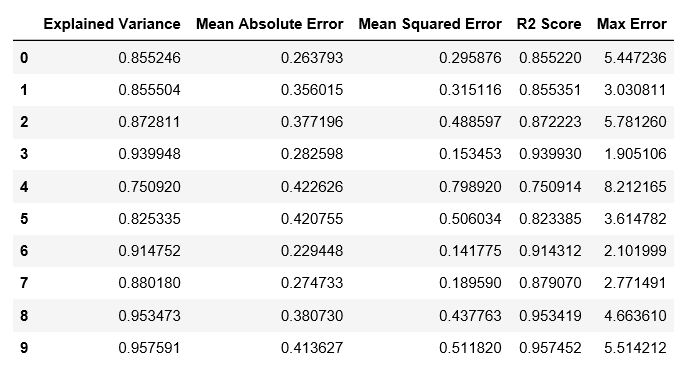
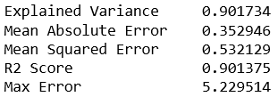

### Introduction 

Agricultural self-propelled sprayers have been used for decades to apply herbicides, pesticides, and fertilizers to crops of all shapes and sizes in all regions of the world. Some of the major components on these machines are: high clearance tires, chassis, solution tank, cab, engine, and a boom which carries the solution away from the machine and applies it to the crop. These machines typically operate at speeds ranging from 8-15 mph, and weigh approximately 20 tons when fully loaded. The boom size typically ranges from 90 ft. to 120 ft. With the size of the boom and mass of the machine, you can quickly see how boom stability becomes a big issue, especially when the machine is operating at speeds upwards of 15 mph. Terrain inputs have an impact on the stability of the machine which have an impact on the stability of the boom. Boom instability causes uneven application of the product which leads to spray drift and reduced yield potential. Uneven boom height across the crop canopy can also lead to crop damage.  Overall, boom height instability is a big issue and causes many issues that can have big agronomic impacts for farmers. 

The current solution to this problem is mechanical boom suspension designs, along with boom height control software. The mechanical boom suspension has been designed to de-couple the boom from the rest of the machine. It consists of linkages which minimally constrain the boom to a swinging motion, and mechanical dampers which aim at dissipating kinetic energy from the system. The boom control software is a feedback loop that is based on ground measurements from ultrasonic sensors located at 5 places across the boom. Hydraulic cylinders tilt the boom up or down to try to maintain a specified target height. The mechanical design and control software certain help with the issue of boom height instability, but it still presents itself as a major issue in the world of self propelled sprayers. 

### Analysis Question 

This project aims at answering the questions: **What causes boom height error? What is the biggest predictor of boom height error?**

Boom height error is the singular metric that determines the system level performance of a sprayer. Many factors influence error, such as boom roll, chassis roll, roll rates, ground speed, and other dynamic machine responses. However, to this day, we don't know what is the most important **cause of boom height error?** Can boom height error be predicted?? This project aims at gaining a better understanding of the ranking of these predictors. By ranking these features in terms of their importance to error, a roadmap starts to form to guide development activities in reducing boom height error. Boom suspensions and control software are solutions to the problem, but a clear definition of **what the problem actually is** does not exist. This analysis aims at defining this problem, so that better solutions can be integrates to improve performance.

### Project Workflow

### Data Description
The data used in this analysis is CAN data from field testing. The signals are packed into a MATLAB structure and all the signals contain a 'time' and a 'val' data vector. Each field run has its own data structure and the runs are distinguished by a run number in the name of the structure containing the data. 

This format required a significant amount of data wrangling to be completed before executing a machine learning analysis. The data had to be down-sampled and rearranged. A MATLAB script takes the data structure for each run and outputs a csv file containing normalized data for each run, along with an error metric. Because each signal is collected at a different frequency, the data had to be down sampled to create a common time vector. The MATLAB script is robust and all that would need to happen to process another dataset is change the numbers of the files to correspond to whatever you want to run. 

### Data Exploration

The plot below shows the process of determining the error for each run. Because this analysis was done on a run-by-run basis in a loop, the data exploration was done mostly manually in MATLAB. This plot is an example of how the data was explored to check for anomalies or issues with the data. Also, the run-by-run random forest analysis exposed some inconsistencies in the data which were later fixed.  

The first ten runs and the results:

### Data Model
The model produced the following mean metrics for the random forest analysis. The random forest analysis was set to 1000 estimators and a training size of 75%. 

The following plots show the results of the random forest analysis. 

Build a model, fit the model, validate the model.

### Discussion and Results
Overall, the analysis produced some interesting results. The results can be summarized by the plot shown below. This plot shows the mean feature importance for each feature over the course of 42 different runs. The error bars represent 2 standard deviations which represents a 95% CI. 

According to this plot, the feature that seemed to have the most significant impact on error was boom roll. However, the distribution of this significance was fairly large. Vehicle speed also seemed to have a significant impact on error, but again the distribution of the significance over the 42 runs was fairly large. The answer to the analysis question appears to be boom roll, then vehicle speed. It is interesting to note that the rates seem to have a very low and consistent importance level. This is useful information and good to know for future development activities. 

To continue this project in the future, many things can be done. This project is a good base for a lot of future development. The structure I created allows for the addition of many other CAN signals which should be used for analysis. Signals such as accelerations, tilt cylinder acutuations, and suspension behavior should be added into this analysis to better understand the vehicle dynamics. Also, the first thing to add in would be a column for severity of terrain input. Then, the whole analysis should be run again and the results should be generated. 

### Class Exercise

The notebook containing the task can be found on the following repo: [Task](https://github.com/mdeutsch13/myproject.git "MarkD Repo")

