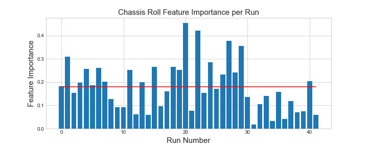

## Boom Height Error Analysis on a Self Propelled Sprayer


### Introduction 
Agricultural self-propelled sprayers have been used for decades to apply herbicides, pesticides, and fertilizers to crops of all shapes and sizes in all regions of the world. Some of the major components on these machines are: high clearance tires, chassis, solution tank, cab, engine, and a boom which carries the solution away from the machine and applies it to the crop. These machines typically operate at speeds ranging from 8-15 mph, and weigh approximately 20 tons when fully loaded. The boom size typically ranges from 90 ft. to 120 ft. With the size of the boom and mass of the machine, you can quickly see how boom stability becomes a big issue, especially when the machine is operating at speeds upwards of 15 mph. Terrain inputs have an impact on the stability of the machine which have an impact on the stability of the boom. Boom instability causes uneven application of the product which leads to spray drift and reduced yield potential. Uneven boom height across the crop canopy can also lead to crop damage.  Overall, boom height instability is a big issue and causes many issues that can have big agronomic impacts for farmers. 

The current solution to this problem is mechanical boom suspension designs, along with boom height control software. The mechanical boom suspension has been designed to de-couple the boom from the rest of the machine. It consists of linkages which minimally constrain the boom to a swinging motion, and mechanical dampers which aim at dissipating kinetic energy from the system. The boom control software is a feedback loop that is based on ground measurements from ultrasonic sensors located at 5 places arcross the boom. Hydraulic cylinders tilt the booom up or down to try to maintain a specified target height. The mechanical design and control software certain help with the issue of boom height instability, but it still presents itself as a major issue in the world of self propelled sprayers. 


### Interesting question 


This project aims at answering the questions: **What causes boom height error? What is the biggest predictor of boom height error?**

Boom height error is the singular metric that determines the system level performance of a sprayer. Many factors influence error, such as boom roll, chassis roll, roll rates, ground speed, and other dynamic machine responses. However, to this day, we don't know what is the most important **cause of boom height error?** Can boom height error be predicted?? This project aims at gaining a better understanding of the ranking of these predictors. By ranking these features in terms of their importance to error, a roadmap starts to form to guide development activities in reducing boom height error. Boom suspensions and control software are solutions to the problem, but a clear definition of **what the problem actually is** does not exist. This analysis aims at defining this problem, so that better solutions can be integrates to improve performance.


What is the scientitifc goal?  What would you do if you had all the data?  What do you want to predict or estimate?  Why is this relevant to ABE researchers or the field?  Provide some background on the rationale and relevance.

### Project Workflow

blah blah blah this is what i gonna do in this project

### Data description
The data used in this analysis is CAN data from field testing. This data comes 


What kind of data is avialble?  How is your data collected?  Are there any concerns about the data?  Which data is the most relevant?  Is the data easy to acccess? Will the data change over time?  What needs to be done to the data to get it ready for any downstream analysis?


### Explore the data

Demonstrate what you would do to describe the data and if it has any patterns or anomolies.  Make some plots.


### Model the data

Build a model, fit the model, validate the model.





### Communciate and visualize the results

What did you learn and do the results make sense?  Revisit your initial question and answer it.  H


### Class Exercise

In each project, I'd like to see a homework assignment that the class can do/evaluate to learn more about your data.  This should be a reproducible notebook that allows them to learn one or more aspects of your data workflow.  It is also an opportunity to share your research with your colleagues.

Here is an example of a fantastic project website:

https://stephenslab.github.io/ipynb-website/


### Notebooks

You can use a website to host notebooks.  First, you'll want to get the "raw" url from Github where your notebook is stored.  Then, navigate to https://nbviewer.jupyter.org and paste that URL.  The result will be a new generated URL that hosts your notebook.  This can be a [link](https://nbviewer.jupyter.org/github/isu-abe/516x/blob/master/module2/bootcamp/notebooks/nocode/Module%20IIB%20-%20Python%20Basics%20-%20no%20code.ipynb) in your website.


### Configuration variables

This instruction is specific to the slate theme but should translate well to other themes.  You can change default variables in your website build by making changes in your `_config.yml` file:

```yml
title: [Sprayer Project]
description: [This site contains a project about sprayers]
```
### Project Workflow

Additionally, you may choose to set the following optional variables:

```yml
show_downloads: ["true" or "false" to indicate whether to provide a download URL]
google_analytics: [Your Google Analytics tracking ID]
```
You can take a look at the `_config.yml` file in this repository to see how to type in the title and description.

### Markdown

You can see this [cheatsheet](https://github.com/adam-p/markdown-here/wiki/Markdown-Cheatsheet) to work with Markdown language for adding features into this website.  This includes how to add headers, organization (e.g., bullets or lists), tables, and images.  It also includes how to add code to a website.

*Note that for images, you will need to place the image file in a place that it can be referenced and called.  I would suggest the github repo might be a good solution.  Often, I make an images folder and can call the raw images file.

See example [here](https://github.com/pages-themes/slate/blob/master/index.md).  You can see the raw code also.

#### Relative Links
To create links to other pages, you can read this article:  https://github.blog/2016-12-05-relative-links-for-github-pages/.  Note that these pages should by default direct to the same local folder/directory the index file is.  In this case, my README.md file is my index. If the files are in a different folder, one should specifiy the path for that folder.


## Advanced Features

### Stylesheet (Advanced)

If you'd like to add your own custom styles:

1. Create a file called `/assets/css/style.scss` in your site
2. Add the following content to the top of the file, exactly as shown:
    ```scss
    ---
    ---

    @import "{{ site.theme }}";
    ```
3. Add any custom CSS (or Sass, including imports) you'd like immediately after the `@import` line

*Note: If you'd like to change the theme's Sass variables, you must set new values before the `@import` line in your stylesheet.*

### Layouts (Advanced)

If you'd like to change the theme's HTML layout:

1. [Copy the original template](https://github.com/pages-themes/slate/blob/master/_layouts/default.html) from the theme's repository<br />(*Pro-tip: click "raw" to make copying easier*)
2. Create a file called `/_layouts/default.html` in your site
3. Paste the default layout content copied in the first step
4. Customize the layout as you'd like

### Overriding GitHub-generated URLs (Advanced)

Templates often rely on URLs supplied by GitHub such as links to your repository or links to download your project. If you'd like to override one or more default URLs:

1. Look at [the template source](https://github.com/pages-themes/slate/blob/master/_layouts/default.html) to determine the name of the variable. It will be in the form of `{{ site.github.zip_url }}`.
2. Specify the URL that you'd like the template to use in your site's `_config.yml`. For example, if the variable was `site.github.url`, you'd add the following:
    ```yml
    github:
      zip_url: http://example.com/download.zip
      another_url: another value
    ```
3. When your site is built, Jekyll will use the URL you specified, rather than the default one provided by GitHub.

*Note: You must remove the `site.` prefix, and each variable name (after the `github.`) should be indent with two space below `github:`.*

For more information, see [the Jekyll variables documentation](https://jekyllrb.com/docs/variables/).


### Contributing (Advanced)

Interested in contributing to Slate? We'd love your help. Slate is an open source project, built one contribution at a time by users like you. See [the CONTRIBUTING file](docs/CONTRIBUTING.md) for instructions on how to contribute.

### Previewing the theme locally

If you'd like to preview the theme locally (for example, in the process of proposing a change):

1. Clone down the theme's repository (`git clone https://github.com/pages-themes/slate`)
2. `cd` into the theme's directory
3. Run `script/bootstrap` to install the necessary dependencies
4. Run `bundle exec jekyll serve` to start the preview server
5. Visit [`localhost:4000`](http://localhost:4000) in your browser to preview the theme

### Running tests

The theme contains a minimal test suite, to ensure a site with the theme would build successfully. To run the tests, simply run `script/cibuild`. You'll need to run `script/bootstrap` one before the test script will work.
